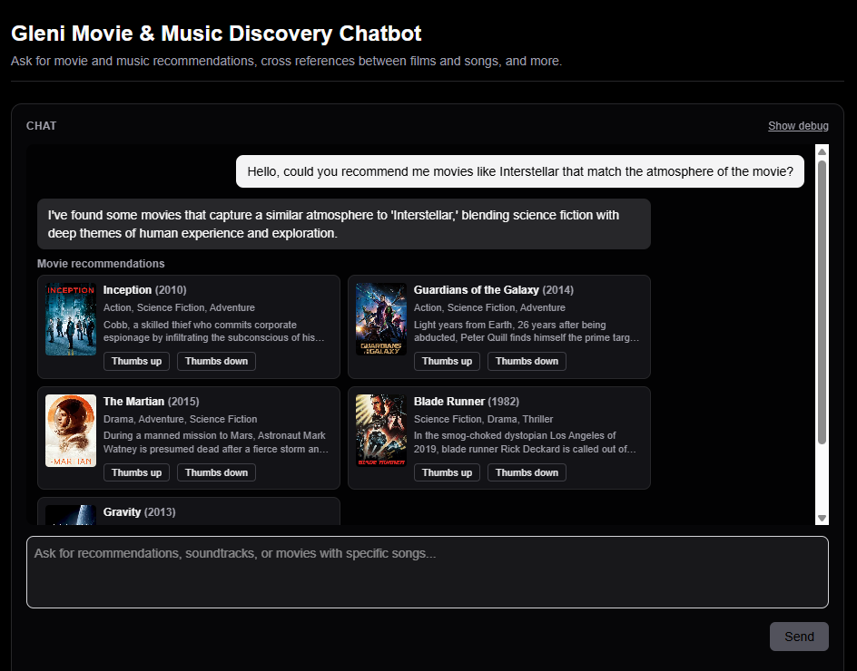
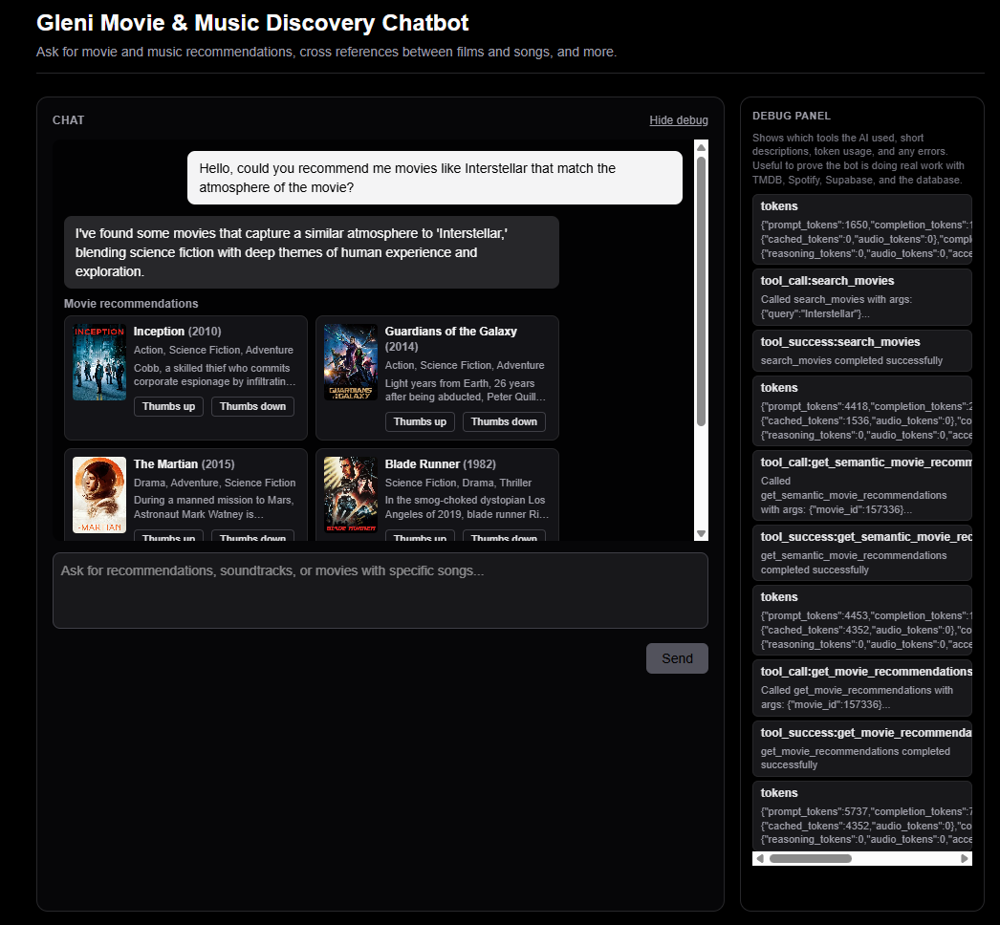

# Gleni Movie Discovery Chatbot

Aplicacion web de chat lista para produccion que ayuda a los usuarios a descubrir peliculas y recomendaciones a traves de una conversacion natural. El bot se integra con **TMDB** (The Movie Database), usa **OpenAI** para razonamiento inteligente y seleccion de herramientas, y guarda preferencias del usuario en una base **Supabase Postgres**.

## Demo en vivo

https://tech-challenge-omega-five.vercel.app/

## Problema que resuelve

En lugar de navegar multiples apps por separado, los usuarios pueden tener una conversacion natural para descubrir contenido nuevo basado en sus gustos, con cruce inteligente entre peliculas y preferencias del usuario.

## Audiencia objetivo

Amantes del cine que quieren descubrimiento y recomendaciones personalizadas.

## Propuesta de valor

Interfaz de conversacion natural para descubrir contenido personalizado, combinando recomendaciones de peliculas en un solo lugar con cruce inteligente.

## Funcionalidades

- **IA conversacional**: Interfaz de lenguaje natural impulsada por OpenAI GPT-4o-mini
- **Descubrimiento de peliculas**: Busqueda, detalles y recomendaciones via la API de TMDB
- **Recomendaciones personalizadas**: Basadas en las peliculas vistas por el usuario
- **Historial persistente**: Supabase Postgres guarda conversaciones y preferencias
- **Panel de debug**: Muestra que herramientas llamo la IA y como razono (feature bonus)
- **Sistema de feedback**: Pulgar arriba/abajo en recomendaciones (feature bonus)
- **Limpiar chat / historial**: Inicia un chat nuevo o borra historial + feedback con confirmacion

## Capturas / Demo





## Historias de usuario

### Como un aficionado al cine
**Quiero** compartir las peliculas que he visto recientemente  
**Para** recibir recomendaciones personalizadas de peliculas similares

**Criterios de aceptacion:**
- [x] El bot guarda mis peliculas vistas en una lista persistente
- [x] El bot genera recomendaciones basadas en mis peliculas guardadas
- [x] Las recomendaciones incluyen informacion relevante (genero, anio, sinopsis)

### Como un usuario que busca recomendaciones
**Quiero** pedir "peliculas como X"  
**Para** descubrir peliculas similares rapidamente

**Criterios de aceptacion:**
- [x] El bot entiende la intencion de similitud
- [x] El bot devuelve recomendaciones con titulo, anio y sinopsis
- [x] El bot explica brevemente por que coinciden

## Tech Stack

- **Frontend + Backend**: Next.js 16 (App Router) + React 19 + TypeScript
- **Styling**: Tailwind CSS 4
- **Database**: Supabase Postgres via Prisma ORM
- **AI**: OpenAI API (GPT-4o-mini) with function calling
- **External APIs**: TMDB API v3 (The Movie Database)
- **Validation**: Zod
- **Testing**: Vitest (configured, basic tests included)
- **Deployment**: Vercel

## Arquitectura

### Frontend (`app/`)
- `page.tsx`: UI principal del chat con lista de mensajes, input y panel de debug
- `layout.tsx`: Root layout con metadata
- `globals.css`: Estilos de Tailwind CSS

### Backend (`app/api/`)
- `chat/route.ts`: Endpoint principal que maneja mensajes del usuario y orquesta AI + tools

### Logica principal (`lib/`)
- `ai/chat.ts`: Orquestacion OpenAI con loop de tool calling
- `ai/tools.ts`: Definiciones de tools y ejecucion
- `tmdb.ts`: Cliente de la API TMDB (busqueda, detalles, recomendaciones)
- `persistence.ts`: Helpers de base de datos (guardar/recuperar historial)
- `prisma.ts`: Prisma client singleton
- `config.ts`: Gestion de variables de entorno
- `semanticRecommendations.ts`: Supabase + pgvector para similitud semantica

### Base de datos (`prisma/`)
- `schema.prisma`: Esquema (Conversation, Message, WatchedMovie, Feedback)

## Primeros pasos

### Prerrequisitos

- Node.js 20+ y npm
- OpenAI API key ([get one here](https://platform.openai.com/api-keys))
- TMDB API key ([get one here](https://www.themoviedb.org/settings/api))

### Instalacion

1. **Clonar el repositorio**

```bash
git clone <your-repo-url>
cd gleni-chat-bot
```

2. **Instalar dependencias**

```bash
npm install
```

3. **Configurar variables de entorno**

Copia `.env.example` a `.env.local`:

```bash
cp .env.example .env.local
```

Edita `.env.local` y completa tus API keys:

```env
OPENAI_API_KEY=your-openai-key-here
TMDB_API_KEY=your-tmdb-key-here
DATABASE_URL="your-database-pooler-url"
DIRECT_URL="your-direct-database-url"
SUPABASE_URL="your-supabase-url"
SUPABASE_SERVICE_ROLE_KEY="your-supabase-service-role-key"
```

4. **Configurar la base de datos**

Genera Prisma Client y ejecuta migraciones:

```bash
npm run prisma:generate
npm run prisma:migrate
```

Esto crea las tablas en tu instancia de Supabase Postgres.

Opcional: **Habilitar recomendaciones semanticas**

Ejecuta la migracion de Supabase en `supabase/migrations/20260205_match_movies.sql` en tu proyecto hospedado (SQL editor).

Luego, realiza el backfill de embeddings (requiere OpenAI + TMDB + Supabase keys):

```bash
npm run backfill:embeddings:full
```

5. **Levantar el servidor de desarrollo**

```bash
npm run dev
```

Abre [http://localhost:3000](http://localhost:3000) en tu navegador.

## Como obtener API keys

### OpenAI API Key

1. Ve a [https://platform.openai.com/api-keys](https://platform.openai.com/api-keys)
2. Registrate o inicia sesion
3. Haz click en "Create new secret key"
4. Copia la key (no se mostrara de nuevo)

### TMDB API Key

1. Ve a [https://www.themoviedb.org](https://www.themoviedb.org)
2. Crea una cuenta
3. Ve a Settings -> API
4. Solicita una API key (aprobacion automatica para uso basico)
5. Copia la API key

## Ejemplos de uso

### Ejemplo 1: Guardar peliculas y obtener recomendaciones

**Usuario**: "I loved The Matrix and Inception"

**Bot**:
- Guarda ambas peliculas en tu historial
- Obtiene recomendaciones para cada una
- Devuelve: "Based on The Matrix and Inception, here are some recommendations: [list]"

### Ejemplo 2: Peliculas como X

**Usuario**: "Give me movies like Interstellar"

**Bot**:
- Busca Interstellar
- Devuelve peliculas similares con explicaciones cortas

## Decisiones tecnicas

### Por que TMDB?

- **TMDB**: Base de datos de peliculas completa con API gratuita, buena documentacion y datos confiables

### Como manejamos rate limits de API

- **TMDB**: El manejo de errores devuelve mensajes amigables cuando hay rate limit
- **OpenAI**: Tool calling limitado a 5 iteraciones para evitar uso excesivo

### Estrategia de prompting

- **System prompt**: Define rol del bot, guias y formato de respuesta
- **Tool descriptions**: Descripciones claras ayudan al LLM a elegir tools
- **Few-shot examples**: Incluidos en el system prompt para guiar el comportamiento

### Limitaciones conocidas


### Mejoras futuras

- Cuentas de usuario con autenticacion (actualmente usa user IDs en localStorage)
- Collaborative filtering (recomendaciones basadas en usuarios similares)
- RAG con embeddings para busqueda semantica de descripciones
- Respuestas en streaming (SSE) para mostrar recomendaciones en tiempo real
- Preferencias del usuario (generos favoritos, etc.) guardadas en base de datos

## Testing

Ejecuta tests con:

```bash
npm test
```

Incluye tests unitarios basicos para la logica de cross-reference. Se pueden agregar E2E con Playwright.

## Deploy en Vercel

1. **Push a GitHub**

```bash
git add .
git commit -m "Initial commit"
git push origin main
```

2. **Deploy en Vercel**

- Ve a [https://vercel.com](https://vercel.com)
- Importa tu repo de GitHub
Agrega variables de entorno en el dashboard de Vercel:
- `OPENAI_API_KEY`
- `TMDB_API_KEY`
- `DATABASE_URL` (usa la connection string pooled de Supabase)
- `DIRECT_URL` (solo necesario si corres migraciones en Vercel)
- `SUPABASE_URL`
- `SUPABASE_SERVICE_ROLE_KEY`

3. **Ejecutar migraciones**

Ejecuta migraciones de Prisma manualmente (por ejemplo, desde tu maquina local o CI):

```bash
npm run prisma:migrate:deploy
```

Si quieres recomendaciones semanticas en produccion, aplica la migracion SQL de Supabase y corre el backfill de embeddings.

## Acciones de admin en la UI

- **Clear chat**: Borra la conversacion actual y empieza una nueva.
- **Clear history**: Borra todas las conversaciones y resetea feedback + historial del usuario. Un modal de confirmacion requiere escribir `CLEAR`.

## Bonus Features Implemented

- [x] **Debug Panel**: Muestra tool calls, respuestas de API y razonamiento del LLM
- [x] **Feedback System**: Pulgar arriba/abajo en recomendaciones (schema listo en DB)
- [x] **Clear Chat / History**: Limpiar chat o borrar historial (con confirmacion)
- [x] **Testing**: Vitest configurado con tests unitarios basicos
- [x] **Rate Limiting**: Errores de rate limit de TMDB con mensajes amigables
- [x] **Accessibility**: HTML semantico, soporte de navegacion por teclado

## Licencia

Este proyecto es parte de un challenge tecnico y se provee tal cual.

## Agradecimientos

- TMDB por los datos de peliculas
- OpenAI por las capacidades de IA
- Next.js y Vercel por el framework y hosting
